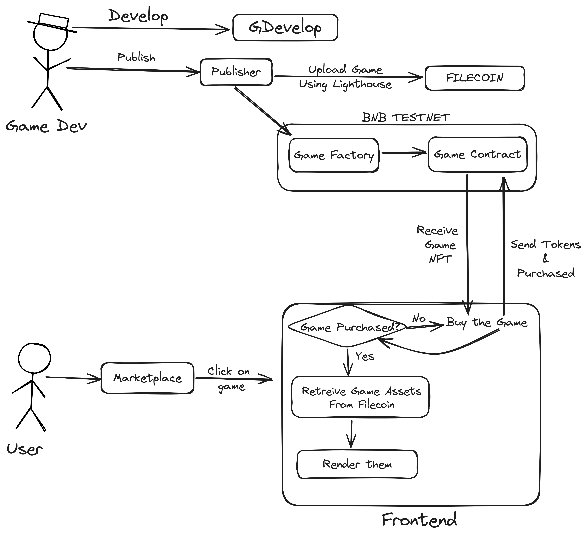

# ImagineNet Project Description

## Intro

In the dynamic world of gaming, 40% of all games sold on Steam are indie games. These are the products of single developers or small teams, driven by passion and creativity. Indie games are celebrated for their innovation, thoughtfulness, and uniqueness. However, creating these games is a labor-intensive and costly endeavor, and developers often face the uncertainty of whether their games will be well-received. Consequently, many talented developers opt to work in large studios on mainstream projects.

## Solution

Introducing ImagineNet, a revolutionary platform where game developers can swiftly build, fund, and launch unique new games. ImagineNet leverages Filecoin to enable developers to cultivate a community around their ideas, rapidly launch MVPs, secure funding, and release complete games—all within a single platform.

## Demo

Let's delve into a quick demo of what ImagineNet offers.

<DEMO>

## How It Works

Having seen the demo, let's explore how ImagineNet functions.

This prototype exemplifies our concept, but our vision extends to establishing a network of builders, users, and investors collaborating for a brighter future.

## Why Filecoin?

Filecoin is the optimal storage solution for ImagineNet for several reasons:
- **Size Compatibility**: Games are substantial in size, and Filecoin allows efficient storage and retrieval of these large files.
- **Web3 Native and Decentralized**: Filecoin seamlessly integrates with our platform, maintaining decentralization.
- **Speed**: Despite its decentralized nature, Filecoin offers impressive speed, ensuring smooth operations.

## Impact

There is an abundance of talented individuals eager to bring their ideas to life, but the high risk involved is a significant deterrent. ImagineNet mitigates these risks, providing developers with the tools, support, and distribution necessary to successfully fund and launch their games. This will result in:
1. A surge in the number of game developers releasing innovative games.
2. The emergence of a new investment asset for the web3 community.
3. Filecoin becoming the primary distribution hub for these games.

## Conclusion

The true vision of web3 is not merely about memecoins but about fostering a creative and decentralized future. With Filecoin, we are paving the way for this future through ImagineNet. Thank you for your time!

## Links
[GDevelop Modified Code](https://github.com/blockdudes/gdevelop-filecoin)
